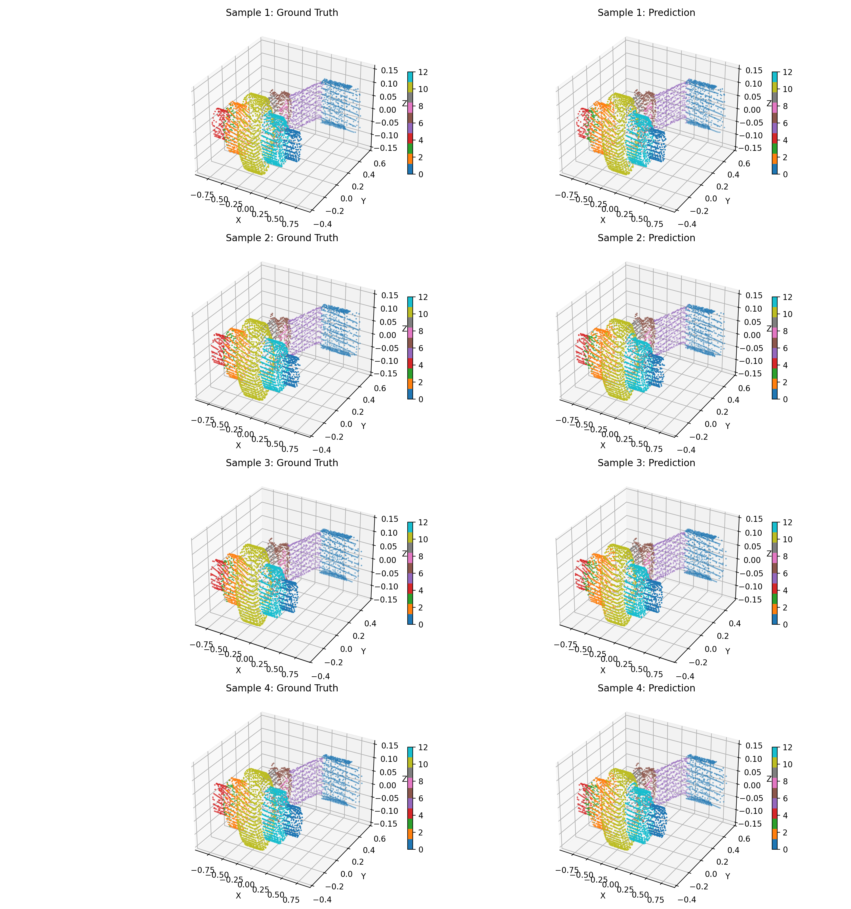

# PointNet для сегментации облаков точек

Реализация модели сегментации облаков точек на основе архитектуры PointNet с использованием PyTorch Lightning.

## Структура проекта

- **train.py** — основной скрипт обучения с управлением конфигурацией через Hydra
- **network.py** — реализация модели сегментации PointNet на базе PyTorch Lightning
- **data_loader.py** — загрузчик датасета сегментации и PyTorch Lightning DataModule
- **dataset_stats.py** — скрипт для сбора статистики по датасету
- **config.yaml** — конфигурационный файл с гиперпараметрами обучения сегментации

## Формат датасета

Модель ожидает датасет в следующем формате:
- Файлы облаков точек в формате `.ply`
- Каждый `.ply` файл должен содержать координаты вершин (x, y, z) и метки для каждой точки
- Метки должны быть целочисленными значениями, представляющими различные семантические классы
- Файлы должны быть размещены в директории, указанной в `data.root` конфигурации

Пример формата `.ply` файла:
```
ply
format ascii 1.0
element vertex 1000
property float x
property float y
property float z
property int label
end_header
0.1 0.2 0.3 1
0.4 0.5 0.6 2
...
```

## Использование

### Анализ статистики датасета

Запустите скрипт для сбора статистики:

```bash
uv run dataset_stats.py
```

### Обучение

Запустите скрипт обучения с конфигурацией по умолчанию:

```bash
uv run train.py
```

Переопределение параметров конфигурации из командной строки:

```bash
uv run train.py training.max_epochs=100 data.num_points=2048 training.batch_size=32
```

### Мониторинг логов

```bash
uv run tensorboard --logdir=logs/pointnet_segmentation
```

## Конфигурация

Отредактируйте `config.yaml` для настройки:
- Параметры данных (количество точек, размер батча, количество классов, ...)
- Гиперпараметры обучения (скорость обучения, эпохи, устройство, настройки оптимизатора, ...)
- Параметры модели (dropout, трансформации признаков, ...)
- Директории для чекпоинтов и логов
- Параметры функции потерь (веса регуляризации, сглаживание меток, ...)

## Результаты

Обучение с конфигурацией из файла `config.yaml` дает следующие результаты:

### Метрики

| Тестовая метрика |  DataLoader 0 |
|:----------------:|:-------------:|
| test_acc         | 0.89559841156 |
| test_iou         | 0.79310548305 |
| test_loss        | 0.25627177953 |

### Визуализации

Предсказания на 4 тестовых образцах:

<div style="display:flex; gap:8px; align-items:center;">
  
</div>
